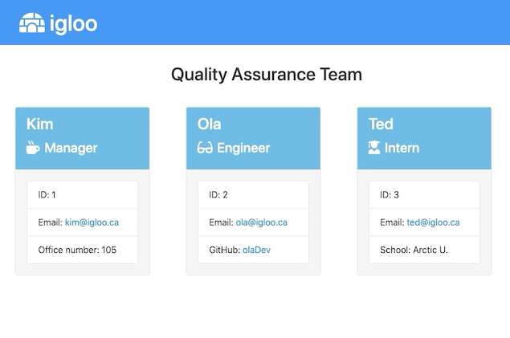

# Team Profile Generator

    

## Description
Team profile generator is a Node CLI that takes in information about employees and when the user has completed building the team, the application will create an HTML file that displays a formatted team roster based on the information provided by the user.

## Table of Contents

* [Installation](#installation)
* [Usage](#usage)
* [Tests](#tests)
* [License](#license)

## Installation
  
 - Once the repository is cloned, change into develop directory: `cd develop` 
 - In the terminal, run `npm install` to install the dependencies (see package.json for dependencies) 
 - The application will be invoked by running `node app.js` in the terminal

## Usage

App Run: employee creation (manager)

App Run: employee creation (engineer)

Sample Output

## Tests
Testing employee classes and CLI user inputs

## License
Licensed under the [MIT](https://choosealicense.com/licenses/mit/) license.
